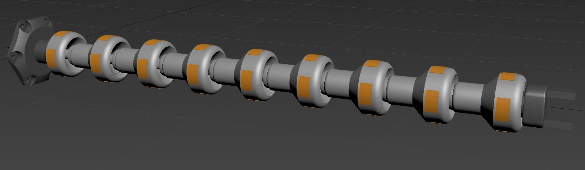

# QuetzalArmURDF
URDF files for the robot manipulator Quetzal Arm 

This arm is exclusively designed for simulation and inverse kinematics (IK) experimentation. It is not intended for prototyping or production purposes of any kind.

 

